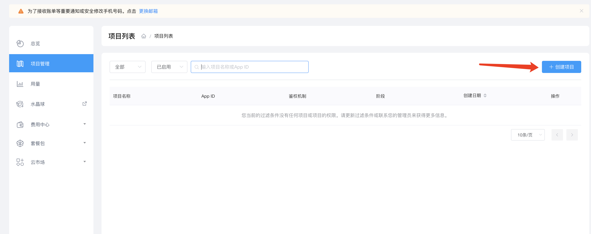
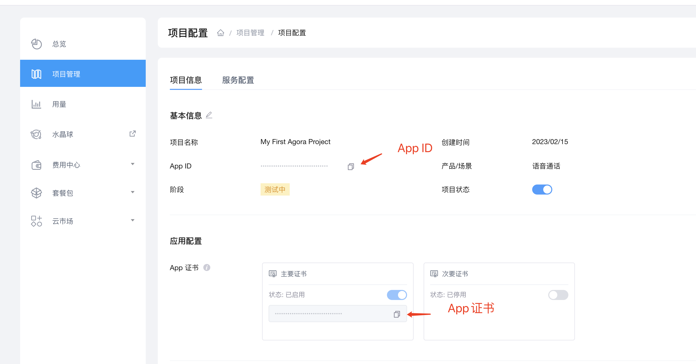
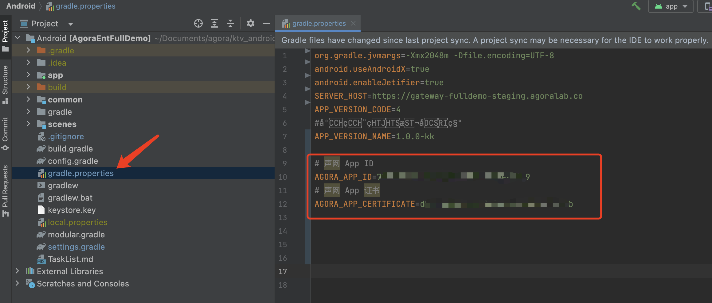

# 在线K歌房

> 本文档主要介绍如何快速跑通 <mark>在线K歌房</mark> 示例工程

---

## 1. 环境准备

- <mark>最低兼容 Android 5.0</mark>（SDK API Level 21）
- Android Studio 3.5及以上版本。
- Android 5.0 及以上的手机设备。

---

## 2. 运行示例

- 获取声网App ID -------- [声网Agora - 文档中心 - 如何获取 App ID](https://docs.agora.io/cn/Agora%20Platform/get_appid_token?platform=All%20Platforms#%E8%8E%B7%E5%8F%96-app-id)

  点击创建应用

  

  选择你要创建的应用类型

  

  得到App ID与App 证书

  

- 获取App 证书 ----- [声网Agora - 文档中心 - 获取 App 证书](https://docs.agora.io/cn/Agora%20Platform/get_appid_token?platform=All%20Platforms#%E8%8E%B7%E5%8F%96-app-%E8%AF%81%E4%B9%A6)

- <mark>联系销售给 AppID 开通 K 歌权限</mark>(如果您没有销售人员的联系方式可通过智能客服联系销售人员[Agora 支持](https://agora-ticket.agora.io/))

- 在项目的[**gradle.properties**](../../gradle.properties)里填写需要的声网 App ID 和 App证书

  

  ```texag-0-1gpap96h0ag-1-1gpap96h0ag-0-1gpap96h0ag-1-1gpap96h0ag-0-1gpap96h0ag-1-1gpap96h0ag-0-1gpap96h0ag-1-1gpap96h0ag-0-1gpap96h0ag-1-1gpap96h0
  AGORA_APP_ID：声网appid
  AGORA_APP_CERTIFICATE：声网Certificate
  ```

- 用 Android Studio 运行项目即可开始您的体验

---

## 3. 项目介绍

### 1.1 概述

> **在线K歌房**项目是声网在线K歌房场景的开源代码，开发者可以获取并添加到您的APP工程里，本源码会伴随声动互娱Demo同步更新，为了获取更多新的功能和更佳的音效，强烈推荐您下载最新代码集成。

### 1.2 功能介绍

> 在线K歌房场景目前已涵盖以下功能，您可以参考注释按需从代码中调用
>
> 场景功能代码根目录**Android/scenes/ktv**
>
> ---
>
> #### 相关网络请求交互
>
> - 标准房间内消息管理
    >
    >   房间内消息管理包括对房间内的基本交互请求和响应，例如用户的变化、已点歌曲列表的变化，通过[**KTVServiceProtocol**](src/main/java/io/agora/scene/ktv/service/KTVServiceProtocol.kt)来定义协议，通过[**KTVSyncManagerServiceImp**](src/main/java/io/agora/scene/ktv/service/KTVSyncManagerServiceImp.kt)来实现，您可以通过自己实现的其他ServiceImp来一键替换，无需改动业务代码。
>
> - 歌曲列表管理
    >
    >   通过声网RtcEngine的IAgoraMusicContentCenter来获取，可以获取实时的歌曲排行榜列表，可以参考[**RoomLivingViewModel**](src/main/java/io/agora/scene/ktv/live/RoomLivingViewModel.java)里的initRTCPlayer
>
> - 房间管理
    >
    >   包含了房间的创建和房间列表的获取
    >
    >   相关代码请参考：[**RoomCreateViewModel**](src/main/java/io/agora/scene/ktv/create/RoomCreateViewModel.java)，分别依赖[**KTVServiceProtocol**](src/main/java/io/agora/scene/ktv/service/KTVServiceProtocol.kt)的下列方法去交互
    >
    >   ```kotlin
>     fun getRoomList(completion: (error: Exception?, list: List<RoomListModel>?) -> Unit)
>     fun createRoom(
>         inputModel: CreateRoomInputModel,
>         completion: (error: Exception?, out: CreateRoomOutputModel?) -> Unit
>     )
>     fun joinRoom(
>         inputModel: JoinRoomInputModel,
>         completion: (error: Exception?, out: JoinRoomOutputModel?) -> Unit
>     )
>   ```
>
> - 歌词管理
    >
    >   点歌、已点歌曲删除、已点歌曲置顶
    >
    >   歌曲列表菜单：请参考[**RoomLivingActivity#showChooseSongDialog**]((src/main/java/io/agora/scene/ktv/live/RoomLivingViewModel.java))
>
> - 音效、美声
    >
    >   声网最佳美声
    >
    >   实现参考[**MusicSettingDialog#Callback**](src/main/java/io/agora/scene/ktv/widget/MusicSettingDialog.java)里的**onEffectChanged**实现

---

## 4. FAQ

### 如何获取声网和环信APPID

> - 声网APPID申请：[https://www.agora.io/cn/](https://www.agora.io/cn/)
> - 环信APPID申请：[https://www.easemob.com/](https://www.easemob.com/)

### 程序运行后，歌曲列表为空

> 需要联系销售给 appId 开通 K 歌权限

### K歌房中的歌曲资源使用的是哪家？是否可以自己选择供应商？

> K歌房的歌曲资源使用的是Agora内容中心服务，暂不支持自行切换供应商，详情请查看[版权音乐 - 在线 K 歌房 - 文档中心 - 声网Agora](https://docs.agora.io/cn/online-ktv/API%20Reference/ios_ng/API/toc_drm.html)

### 集成遇到困难，该如何联系声网获取协助

> 方案1：如果您已经在使用声网服务或者在对接中，可以直接联系对接的销售或服务；
>
> 方案2：发送邮件给[support@agora.io](mailto:support@agora.io)咨询

---
