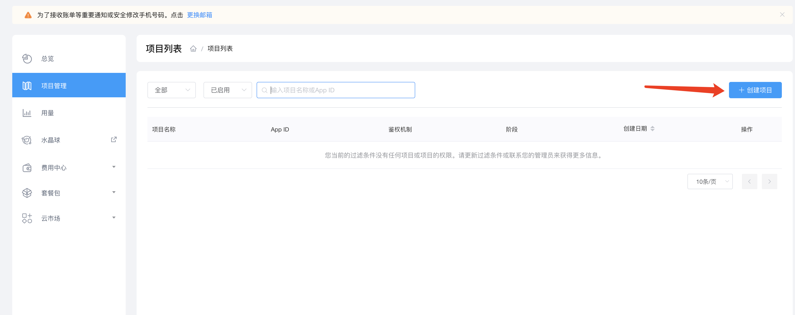
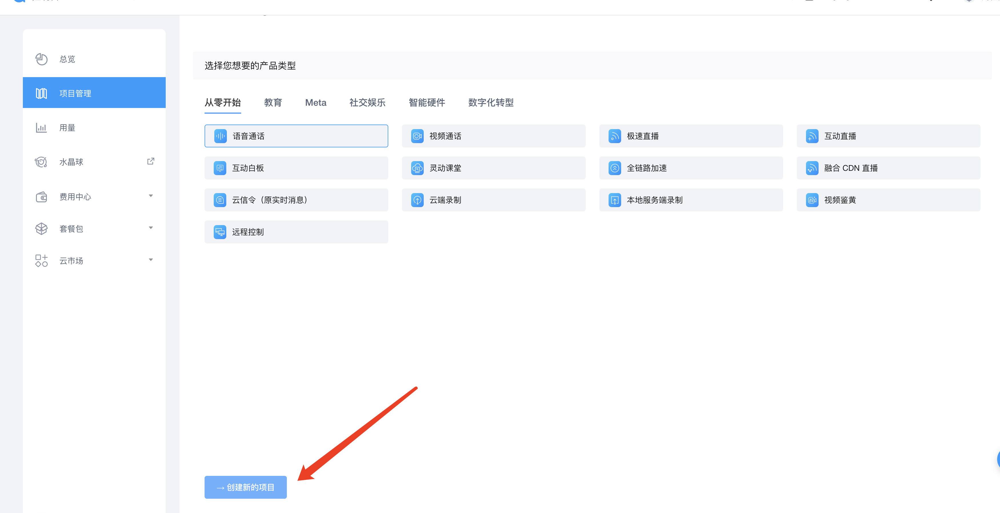
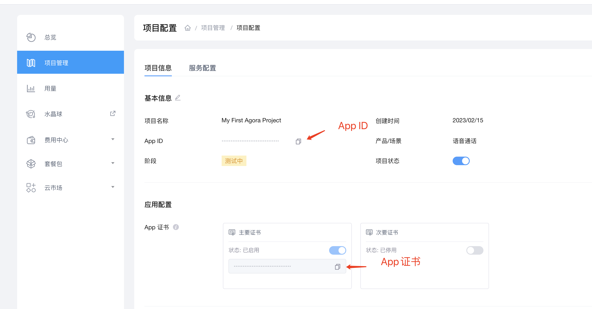
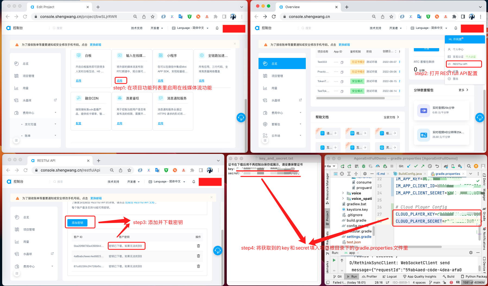
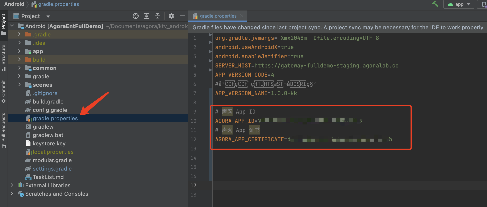
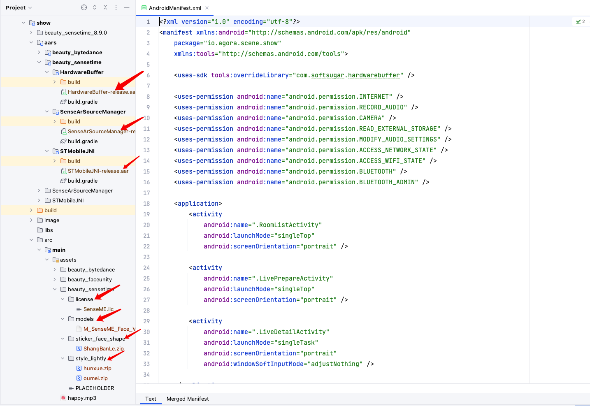
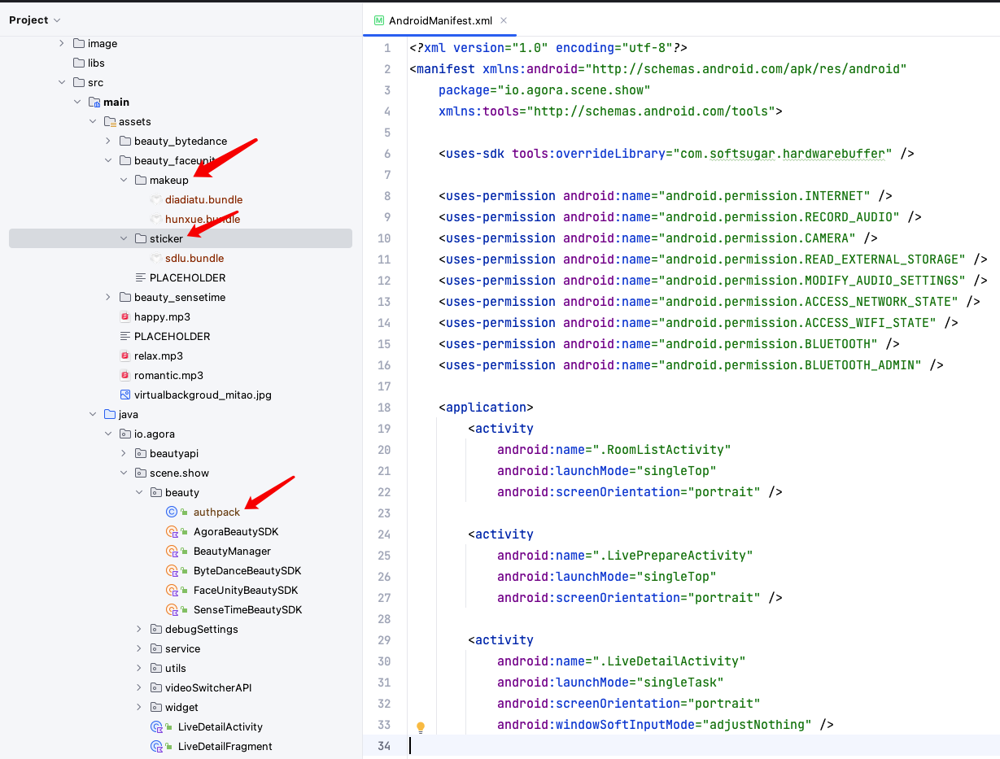

# 秀场直播

> 本文档主要介绍如何快速跑通 <mark>秀场直播</mark> 示例工程
> 
> Demo 效果:
> 
> 
---

## 1.环境准备

- 最低兼容 Android 5.0（SDK API Level 21）
- Android Studio 3.5及以上版本。
- Android 5.0 及以上的手机设备。

---

## 2.运行示例

- <mark>1. </mark> 获取声网App ID -------- [声网Agora - 文档中心 - 如何获取 App ID](https://docs.agora.io/cn/Agora%20Platform/get_appid_token?platform=All%20Platforms#%E8%8E%B7%E5%8F%96-app-id)  
  
  > - 点击创建应用  
  >   
  >     
  > 
  > - 选择你要创建的应用类型  
  >   
  >     
  > 
  > - 得到App ID与App 证书  
  >   
  >     
  > 
  > - 秒切机器人服务配置（CloudPlayer）
  >
  >   

  获取App 证书 ----- [声网Agora - 文档中心 - 获取 App 证书](https://docs.agora.io/cn/Agora%20Platform/get_appid_token?platform=All%20Platforms#%E8%8E%B7%E5%8F%96-app-%E8%AF%81%E4%B9%A6) 

- <mark>2. </mark>在 [**settings.gradle**](../../settings.gradle) 内取消对秀场直播 include 的注释
~~~
if(!isShowEmpty){
    include ':scenes:show'
    include ':scenes:show:aars:SenseArSourceManager'
    include ':scenes:show:aars:STMobileJNI'
}
~~~

- <mark>3. </mark> 在项目的[**gradle.properties**](../../gradle.properties)里填写需要的声网 App ID 和 App证书  
    
  
  ```texag-0-1gpap96h0ag-1-1gpap96h0ag-0-1gpap96h0ag-1-1gpap96h0ag-0-1gpap96h0ag-1-1gpap96h0ag-0-1gpap96h0ag-1-1gpap96h0ag-0-1gpap96h0ag-1-1gpap96h0
  AGORA_APP_ID：声网appid  
  AGORA_APP_CERTIFICATE：声网Certificate 
  CLOUD_PLAYER_KEY：声网RESTful API key
  CLOUD_PLAYER_SECRET：声网RESTful API secret
  ```

- <mark>4. </mark> 美颜配置
  
  **商汤美颜配置**
  美颜资源请联系商汤科技商务获取。
  
  
  
  > - 将STMobileJNI-release.aar放在**scenes/show/aars/beauty_sensetime/STMobileJNI**目录下
  > 
  > - 将SenseArSourceManager-release.aar放在**scenes/show/aars/beauty_sensetime/SenseArSourceManager**目录下
  > 
  > - HardwareBuffer-release.aar放在**scenes/show/aars/beauty_sensetime/HardwareBuffer**目录下
  > 
  > - 将SDK里的资源文件复制到**scenes/show/src/main/assets/beauty_sensetime** 目录下。这个项目用到的资源文件列举如下：
  >   
  >   - license/SenseME.lic : 证书资源
  >   - models/*.model : AI等训练模型资源
  >   - sticker_face_shape/lianxingface.zip : 贴纸资源
  >   - style_lightly/*.zip : 风格妆资源

  **相芯美颜配置**
  美颜资源请联系相芯商务获取。

  

  > - 将相芯证书authpack.java放在**scenes/show/src/main/java/io/agora/scene/show/beauty**目录下
  > 
  > - 将SDK里的资源文件复制到**scenes/show/src/main/assets/beauty_faceunity** 目录下。这个项目用到的资源文件列举如下：
  >
  >   - makeup : 风格妆资源
  >   - sticker : 贴纸资源

  **火山美颜配置**
  美颜资源请联系火山商务获取。
  
  
  
  > - 将effectAAR-release.aar放在**scenes/show/aars/beauty_bytedance/EffectAAR**目录下
  >
  > - 将SDK里的资源文件复制到**scenes/show/src/main/assets/beauty_bytedance** 目录下。这个项目用到的资源文件列举如下：
  >
  >   - LicenseBag.bundle : 证书资源
  >   - ModelResource.bundle : AI等训练模型资源
  >   - StickerResource.bundle : 贴纸资源
  >   - ComposeMakeup.bundle : 风格妆资源
  > 
  > - 修改**scenes/show/src/main/java/io/agora/scene/show/beauty/ByteDanceBeautySDK.kt**中LICENSE_NAME为证书文件名

- <mark>5. </mark> 用 Android Studio 运行项目即可开始您的体验

---
## 3.项目介绍
- <mark>1. 概述</mark> 
> 秀场直播项目是声网秀场直播场景的开源代码，开发者可以获取并添加到您的APP工程里，本源码会伴随声动互娱Demo同步更新，为了获取更多新的功能和更佳的体验，强烈推荐您下载最新代码集成。
- <mark>2. 功能介绍</mark> 
> 秀场直播场景目前已涵盖以下功能
> - PK 和连麦 
> 
>   相关代码请参考：[LiveDetailFragment](src/main/java/io/agora/scene/show/LiveDetailFragment.kt) 中的 updatePKingMode() 和 updateLinkingMode() 的实现。
>
> - 秒切
>
>   相关代码请参考：[LiveDetailActivity](src/main/java/io/agora/scene/show/LiveDetailActivity.kt) 中的 OnPageChangeCallback 的实现。
> - 美颜
>
>   美颜是通过注册视频帧观测器，在视频观测器的 onCaptureVideoFrame 回调中通过商汤美颜SDK处理视频帧数据并替换实现美颜功能。
>   
>   商汤美颜功能的详细封装请参考：[SenseTimeBeautyAPIImpl](src/main/java/io/agora/beautyapi/sensetime/SenseTimeBeautyAPIImpl.kt) 的实现。
>   相芯美颜功能的详细封装请参考：[FaceUnityBeautyAPIImpl](src/main/java/io/agora/beautyapi/faceunity/FaceUnityBeautyAPIImpl.kt) 的实现。
>   火山美颜功能的详细封装请参考：[ByteDanceBeautyAPIImpl](src/main/java/io/agora/beautyapi/bytedance/ByteDanceBeautyAPIImpl.kt) 的实现。
>   
>   ``` 
>    @Override
>    public boolean onCaptureVideoFrame(VideoFrame videoFrame) {
>        ...
>      videoFrame.replaceBuffer(newBuffer, videoFrame.getRotation(), videoFrame.getTimestampNs());
>    }
>   ```
> - 虚拟背景和虚化背景
>   
>   相关代码参考：[BeautyDialog](src/main//java//io//agora//scene//show//widget//BeautyDialog.kt) 中 onItemSelected.GROUP_ID_VIRTUAL_BG 部分。

## 4.FAQ
### 运行或集成遇到困难，该如何联系声网获取协助

方案1：如果您已经在使用声网服务或者在对接中，可以直接联系对接的销售或服务；

方案2：发送邮件给 [support@agora.io](mailto:support@agora.io) 咨询

---

## 代码许可

示例项目遵守 MIT 许可证。

---

