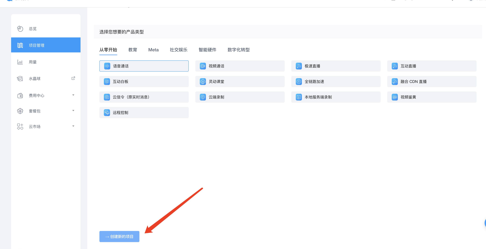
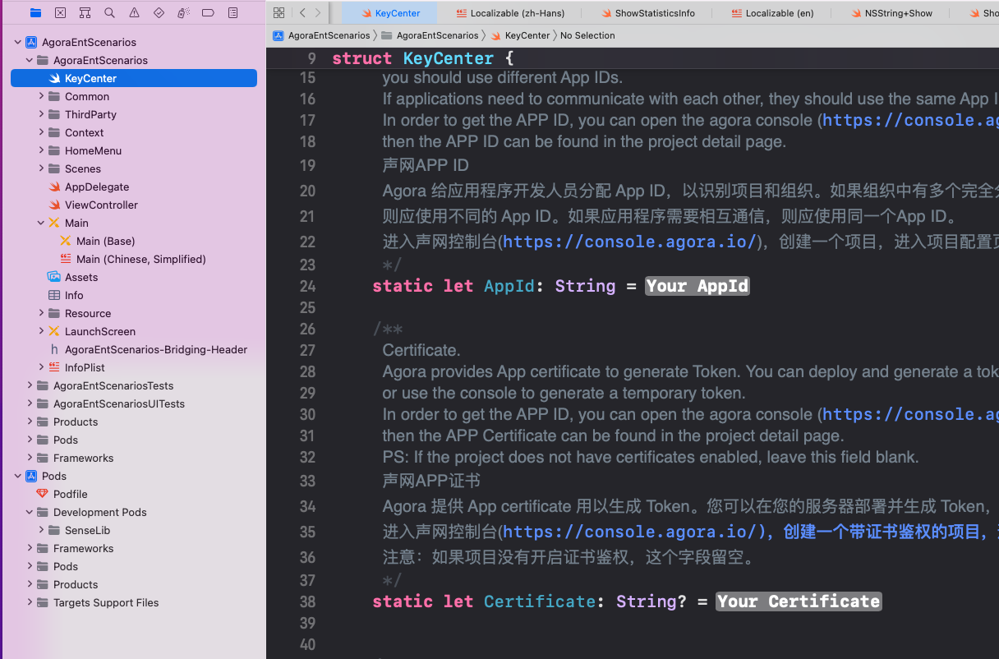
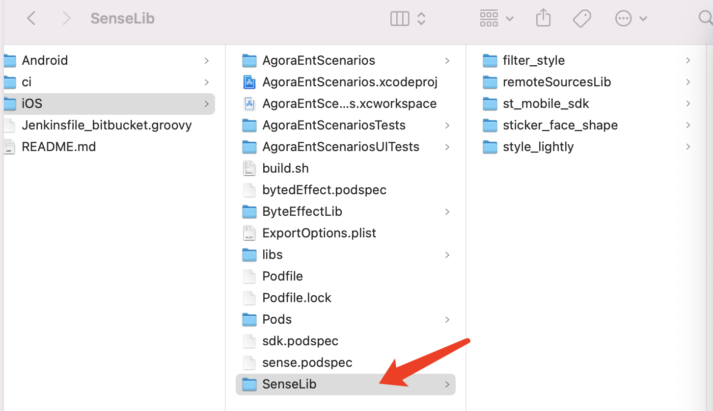
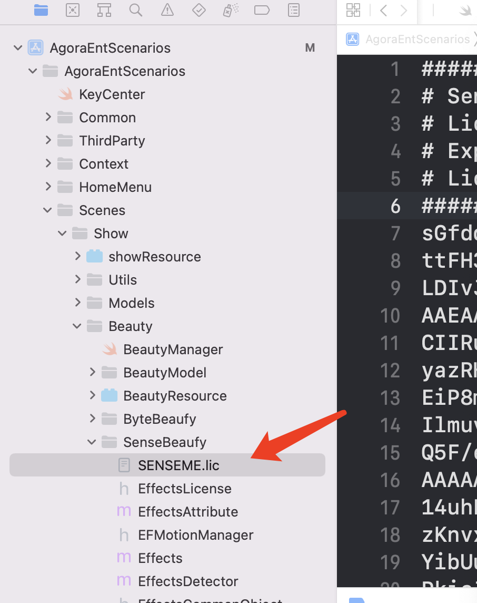

# 秀场直播

> 本文档主要介绍如何快速跑通 <mark>秀场直播</mark> 示例工程

---

## 1. 环境准备

- <mark>最低兼容 iOS 13.0</mark>
- Xcode

---

## 2. 运行示例

- 获取声网App ID -------- [声网Agora - 文档中心 - 如何获取 App ID](https://docs.agora.io/cn/Agora%20Platform/get_appid_token?platform=All%20Platforms#%E8%8E%B7%E5%8F%96-app-id)
  
  > - 点击创建应用
  >   
  >   
  > 
  > - 选择你要创建的应用类型
  >   
  >   
  > 
  > - 得到App ID与App 证书
  >   
  >   

- 获取App 证书 ----- [声网Agora - 文档中心 - 获取 App 证书](https://docs.agora.io/cn/Agora%20Platform/get_appid_token?platform=All%20Platforms#%E8%8E%B7%E5%8F%96-app-%E8%AF%81%E4%B9%A6)

- 在项目的[KeyCenter.swift](AgoraEntScenarios/KeyCenter.swift)里填写需要的声网 App ID 和 App证书
  
  
  
  ```texag-0-1gpap96h0ag-1-1gpap96h0ag-0-1gpap96h0ag-1-1gpap96h0ag-0-1gpap96h0ag-1-1gpap96h0ag-0-1gpap96h0ag-1-1gpap96h0ag-0-1gpap96h0ag-1-1gpap96h0
  static let AppId: String = 声网AppID
  static let Certificate: String? = 声网App证书
  ```


- 美颜配置
  
  美颜资源请联系商汤科技商务获取。
  
  > - 新建一个文件夹命名为SenseLib放在Podfile的同级目录下，并将商汤SDK里的资源文件复制到SenseLib 目录下。如图：
  > 
  >  
  >  
  > - 将申请到的商汤的license文件命名为“SENSEME.lic”并拖入工程 如图：
  > 
  >   
  >   

- 更新pod

  > pod install

- 运行项目即可开始您的体验

---

## 3. 项目介绍

### 1.1 概述

> **秀场直播**项目是声网秀场直播场景的开源代码，开发者可以获取并添加到您的APP工程里，本源码会伴随声动互娱Demo同步更新，为了获取更多新的功能和更佳的体验，强烈推荐您下载最新代码集成。

### 1.2 功能介绍

> 秀场直播场景目前已涵盖以下功能
> 
> - PK 和连麦
> 
>   相关代码请参考：[ShowLiveViewController](Controller/ShowLiveViewController.swift )中的 _onStartInteraction中对应的.pking和. onSeat的实现
> 
> - 秒切  
> 
>    相关代码请参考：[ ShowLivePagesViewControll](Controller/ShowLivePagesViewController.swift )
> 
> - 美颜
> 
>   美颜SDK的调用入口是在 [ShowAgoraKitManager](Models/ShowAgoraKitManager.swift )中AgoraVideoFrameDelegate的回调方法
> ```texag-0-1gpap96h0ag-1-1gpap96h0ag-0-1gpap96h0ag-1-1gpap96h0ag-0-1gpap96h0ag-1-1gpap96h0ag-0-1gpap96h0ag-1-1gpap96h0ag-0-1gpap96h0ag-1-1gpap96h0
>    func onCapture(_ videoFrame: AgoraOutputVideoFrame) -> Bool {
>         videoFrame.pixelBuffer = BeautyManager.shareManager.processFrame(pixelBuffer: videoFrame.pixelBuffer)
>         return true
>     }
>  ```
>  
>    商汤美颜功能的详细封装请参考[SenseBeautyManager](Beauty/SenseBeaufy/SenseBeautyManager.swift)
>  
> - 虚拟背景和虚化背景
> 
>    相关代码请参考： [ShowAgoraKitManager](Models/ShowAgoraKitManager.swift )的函数enableVirtualBackground和seVirtualtBackgoundImage
>  
## 4. FAQ

### 如何获取声网和环信APPID

> - 声网APPID申请：[https://www.agora.io/cn/](https://www.agora.io/cn/)
> 
### 集成遇到困难，该如何联系声网获取协助

> 方案1：如果您已经在使用声网服务或者在对接中，可以直接联系对接的销售或服务；
> 
> 方案2：发送邮件给[support@agora.io](mailto:support@agora.io)咨询

---